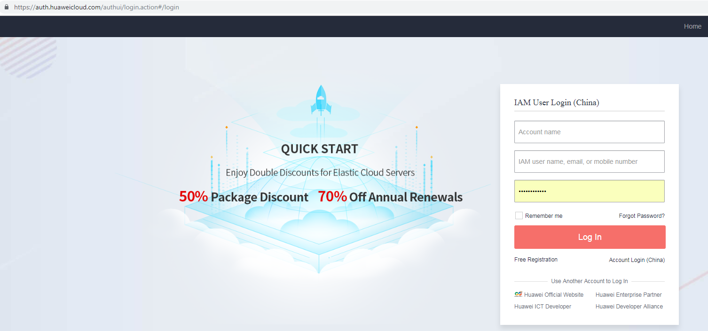
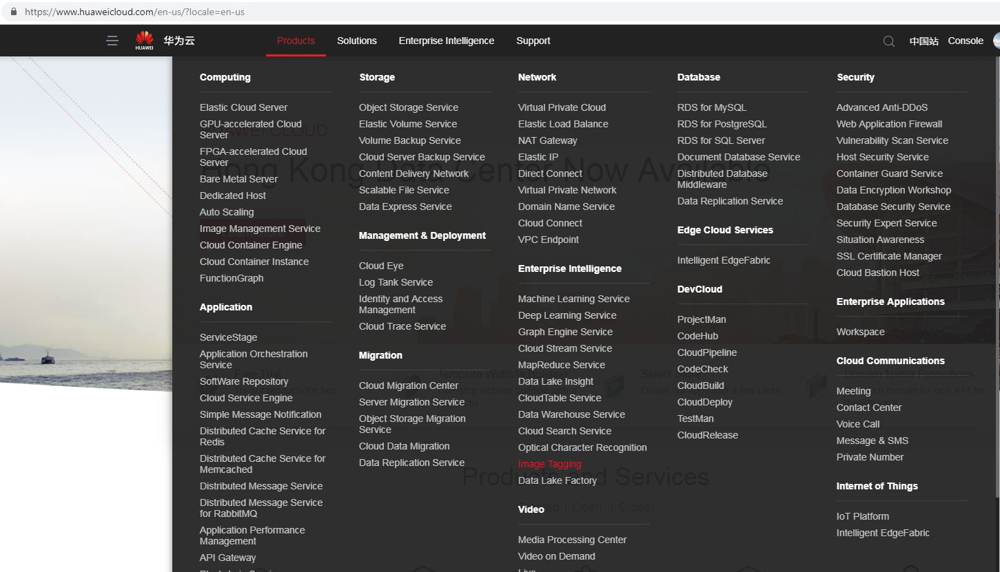
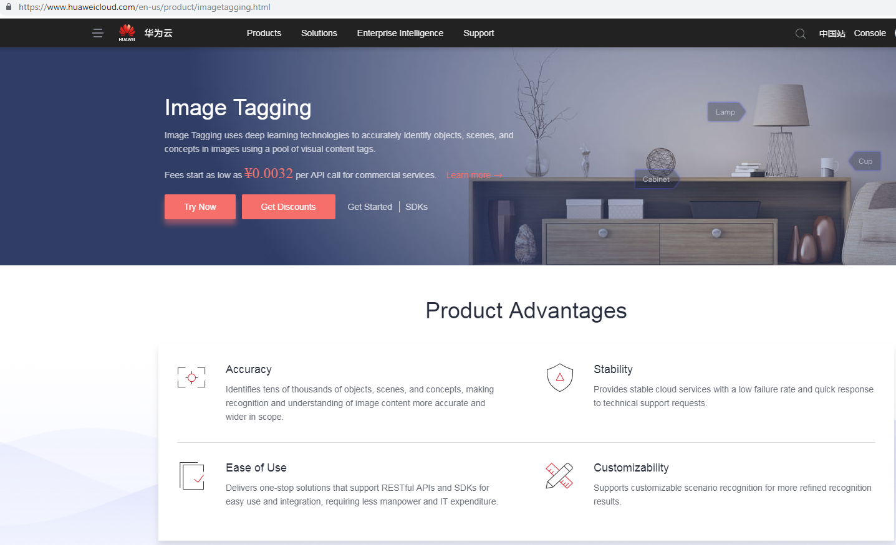
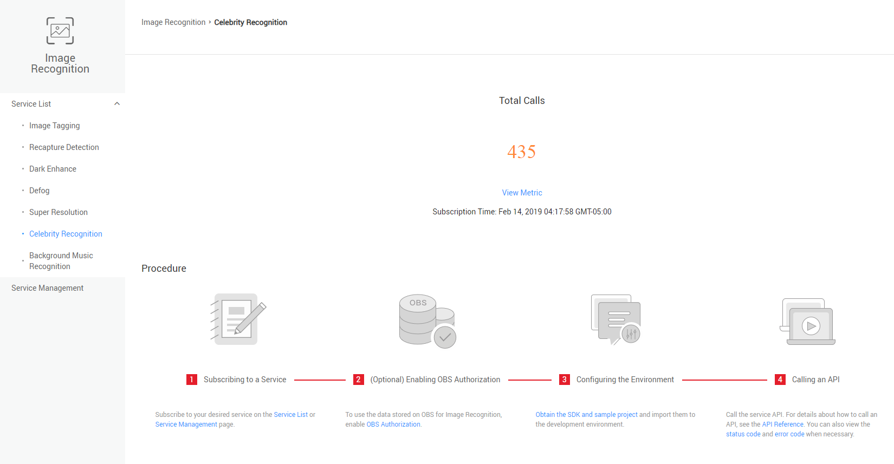

## Step 6:  Enable Celebrity Recognition Service

1.	Login to Huawei cloud.   

2.	Select Image tagging from Products->Enterprise Intelligence.

3.	Click on Try Now.  

  

4.  Click on Celebrity Recognition from the left menu.Click on Subscribe button.The service will be availabe to use now.
    After the service is enabled you can view the details as below.
  

    Refer to https://support.huaweicloud.com/en-us/api-image/image_03_0027.html for more details about celebrity service APIs.
